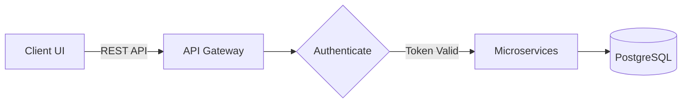
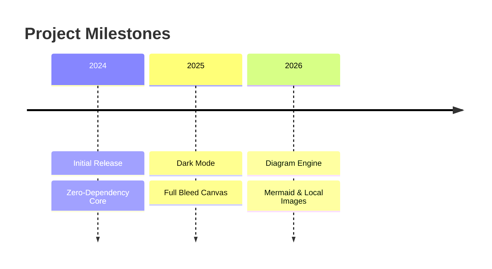

# md2pdf 📄✨

> **Zero-dependency, high-fidelity Markdown to PDF converter powered by your system's built-in Chromium / Edge engine.**

Convert Markdown documents into publication-ready, beautifully styled PDFs with syntax highlighting, clean typography, tables, hardware keycaps, LaTeX math symbols, Mermaid diagrams, local images, and GitHub-style callouts — without installing massive LaTeX toolchains, Pandoc, Node.js, or heavyweight Python dependencies.

---

## ⚡ Highlights

- **Zero External Dependencies:** Built entirely with the Python Standard Library. No `pip install` required for basic use.
- **Native Browser Rendering Engine:** Leverages the headless Microsoft Edge, Google Chrome, or Brave browser already on your machine for pixel-perfect CSS3 rendering.
- **Mermaid.js Diagram Support:** Automatic vector rendering of `graph LR`, `graph TD`, `timeline`, `flowchart`, `sequenceDiagram`, `gantt`, `classDiagram`, `stateDiagram`, `erDiagram`, `pie`, and `gitGraph`.
- **Local & Remote Image Embedding:** Automatically resolves relative image paths (``) relative to your Markdown file location.
- **2 Flexible Usage Modes:** Run as a single portable file anywhere, or install globally as a system CLI command.
- **Built-in Themes:** Comes with `default` (modern clean), `dark` (developer dark mode), and `academic` (formal serif paper) styles.
- **GitHub Alert Callouts:** Full support for `> [!NOTE]`, `> [!TIP]`, `> [!IMPORTANT]`, `> [!WARNING]`, and `> [!CAUTION]`.
- **Keycaps & Math Symbols:** Native rendering of `<kbd>` tags and LaTeX math/arrows (`$\rightarrow$`, `$\approx$`, `$\le$`, etc.).
- **Advanced Markdown Support:** Tables, code blocks, checklists (`- [x]`), images, blockquotes, and explicit page breaks.
- **Cross-Platform:** Works seamlessly across Windows, macOS, and Linux.

---

## 🚀 Two Ways to Use md2pdf

Choose the workflow that suits your preference:

### 🔹 Method 1: Portable Mode (Zero Installation Needed)
If you do not want to install anything on your system, simply copy [`md2pdf.py`](md2pdf.py) into the folder where your `.md` file is located and run it with Python:

```bash
# 1. Place md2pdf.py in your project folder
# 2. Run the converter directly:
python md2pdf.py document.md
```

> **Why choose this?**
> * 100% portable — drop the single `.py` file onto a USB drive, server, or project folder.
> * Requires nothing except Python and your existing web browser.

---

### 🔹 Method 2: Global CLI Mode (Run from ANY Folder)
If you frequently work with Markdown across different projects and directories, install `md2pdf` globally once. You can then execute `md2pdf` anywhere without needing `md2pdf.py` in that folder:

#### Step 1: Install Globally
Clone or download the repo and install it in editable mode:
```bash
git clone https://github.com/Adil-Arbaz-Khan/md2pdf.git
cd md2pdf
pip install -e .
```
*(Or install directly from GitHub without cloning):*
```bash
pip install git+https://github.com/Adil-Arbaz-Khan/md2pdf.git
```

#### Step 2: Use Anywhere on Your System
Open a terminal in **any** folder on your computer and run:
```bash
# In any directory (e.g. C:\Users\Documents, D:\Projects):
md2pdf notes.md
md2pdf report.md -t dark -o final_report.pdf
```

---

## 📊 Diagram & Image Examples

### 1. Mermaid Flowcharts & Graphs (`graph LR`, `graph TD`)
````markdown

````

### 2. Timeline Diagrams
````markdown

````

### 3. Local & Web Images
```markdown
# Relative local file path:


# Remote web URL:

```

---

## 📖 Command Line Options

```text
usage: md2pdf [-h] [-o OUTPUT] [-t {default,dark,academic}] [-c CSS]
              [-s {A4,Letter,Legal,A3,A5}] [-r {portrait,landscape}]
              [-m MARGIN] [--header-footer] [--browser-path BROWSER_PATH]
              [--keep-html] [-v]
              input

Zero-dependency Markdown to PDF converter using headless browser rendering.

positional arguments:
  input                 Path to input Markdown (.md) file

options:
  -h, --help            show this help message and exit
  -o, --output OUTPUT   Path to output PDF file (default: same name as input)
  -t, --theme {default,dark,academic}
                        Built-in theme style (default: default)
  -c, --css CSS         Path to custom CSS file for styling override
  -s, --page-size {A4,Letter,Legal,A3,A5}
                        Page size (default: A4)
  -r, --orientation {portrait,landscape}
                        Page orientation (default: portrait)
  -m, --margin MARGIN   Page margins (default: '16mm 14mm 16mm 14mm')
  --header-footer       Include browser header (date/title) and footer (URL/page)
  --browser-path BROWSER_PATH
                        Explicit path to Chrome/Edge binary executable
  --keep-html           Keep intermediate HTML file after conversion
  -v, --version         show program's version number and exit
```

---

## 🎨 Themes

| Theme | Description | Ideal For |
| :--- | :--- | :--- |
| **`default`** | Modern sans-serif (Plus Jakarta Sans), light theme, crisp vector diagrams | Technical docs, cheatsheets, notes |
| **`dark`** | Deep slate (`#0f172a`), high-contrast text, dark-mode Mermaid themes | Developer manuals, terminal logs |
| **`academic`** | Classic serif typography (Times New Roman), justified margins, formal tables | Research papers, formal essays |

---

## 🛠️ Architecture & Under the Hood

```
┌──────────────┐     md2pdf Parser Engine          ┌────────────────┐     Headless Chromium Engine     ┌──────────────┐
│ Markdown Doc │ ────────────────────────────────> │ Clean HTML5    │ ───────────────────────────────> │ Rendered PDF │
│   (.md)      │   (Generates DOM + Theme CSS)     │ + @page Styles │     (msedge / chrome headless)   │   (.pdf)     │
└──────────────┘                                   └────────────────┘                                  └──────────────┘
```

1. **Parser:** Parses Markdown structures (headers, code snippets, lists, tables, callouts, keycaps, math, and diagrams) into semantic HTML5 with local image URI resolution.
2. **Styler:** Injects tailored CSS3 with print media directives (`@page`, `page-break-inside: avoid`).
3. **Renderer:** Launches Chromium in headless mode with virtual time budgeting to rasterize Mermaid SVGs and compile the vector PDF via `--print-to-pdf`.

---

## 📦 Python Module Usage

You can also import `md2pdf` directly inside your Python scripts:

```python
from md2pdf import convert

# Simple conversion
pdf_path = convert("README.md")

# Advanced conversion with options
pdf_path = convert(
    input_file="report.md",
    output_file="dist/report.pdf",
    theme="dark",
    page_size="A4",
    margin="16mm 14mm 16mm 14mm"
)
print(f"Generated PDF: {pdf_path}")
```

---

## 🤝 Contributing

Contributions, issues, and feature requests are welcome! Feel free to check the [issues page](https://github.com/Adil-Arbaz-Khan/md2pdf/issues).

---

## 📄 License

Distributed under the **MIT License**. See [`LICENSE`](LICENSE) for more information.
