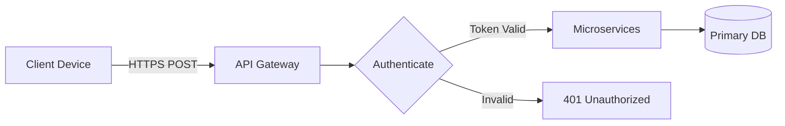
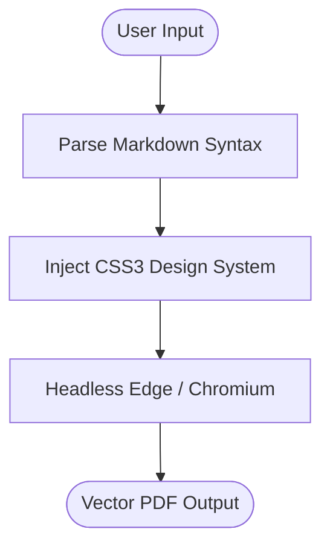
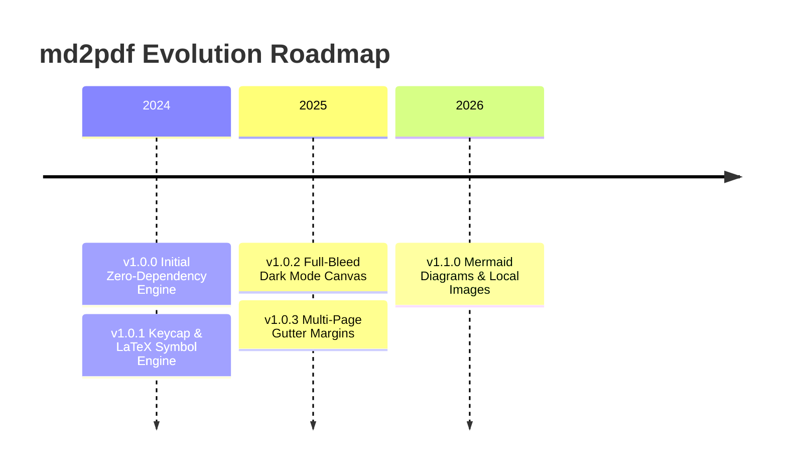

# Project Overview & Quick Demonstration

Welcome to **md2pdf**. This sample document illustrates how various Markdown syntax elements render into the final PDF output.

---

## 1. Two Ways to Run md2pdf

### 🔹 Method 1: Portable / Local Mode (Zero Installation)
Drop `md2pdf.py` into the exact folder where your Markdown file lives and run:
```powershell
python md2pdf.py example.md
```
> *Ideal for quick one-off exports, thumb drives, and zero-setup environments.*

### 🔹 Method 2: Global CLI Mode (Run Anywhere)
Install once using `pip install -e .` and run from **any directory** on your computer without needing `md2pdf.py` in that folder:
```powershell
md2pdf example.md -t dark -o example_dark.pdf
```
> *Ideal for daily development across multiple workspaces.*

---

## 2. Callout Alert Boxes

> [!NOTE]
> This is an informational callout block. It uses subtle slate blue borders and backgrounds.

> [!TIP]
> Use fast swipe gestures with tight durations (e.g. 100ms) for high-performance UI automation.

> [!WARNING]
> Ensure device authorization is confirmed before initiating mass package uninstallation.

---

## 3. Structured Data & Tables

| Category | Parameter | Default Value | Notes |
| :--- | :--- | :---: | :--- |
| **System** | Screen Resolution | `1080 x 2412` | Full HD+ Display |
| **Network** | Wi-Fi State | `Enabled` | Dual-band 2.4 / 5 GHz |
| **Audio** | Volume Level | `Level 12` | Media channel |

---

## 4. Syntax Highlighted Code Blocks

```powershell
# Fast PIN Unlock with zero artificial animation delay:
adb shell "input keyevent KEYCODE_WAKEUP && input swipe 540 1800 540 540 50 && input text 000000 && input keyevent 66"

# Universal Hotspot Toggle:
adb shell "input keyevent KEYCODE_WAKEUP && cmd statusbar expand-settings && sleep 0.5 && input tap 786 528"
```

---

## 5. Checklist & Task Management

- [x] Implement zero-dependency Markdown parser
- [x] Connect headless Edge/Chromium engine
- [x] Configure A4 print media styling
- [x] Native Mermaid.js diagrams & timelines
- [x] Automatic local & remote image embedding

---

## 6. Inline Formatting

You can write ***bold italic text***, ~~strikethrough text~~, `inline code snippets`, and [hyperlinks](https://github.com/Adil-Arbaz-Khan/md2pdf).

---

## 7. Keyboard Shortcuts & Math / Arrow Symbols

* **Keyboard Keys:** Press <kbd>Ctrl</kbd> + <kbd>Shift</kbd> + <kbd>P</kbd> to open the Command Palette, or <kbd>Alt</kbd> + <kbd>F4</kbd> to exit.
* **Arrow & Flow Sequences:** Client $\rightarrow$ Daemon $\rightarrow$ Hardware execution.
* **Mathematical Notations:** $X \approx 100$, $A \neq B$, $P \le Q$, $M \ge N$, $5 \times 10^3$, $360^\circ$ rotation, and $\pm 5\%$.

---

## 8. Mermaid Diagrams (Flowcharts & Graphs)

### Graph LR (Left-to-Right Architecture)


### Graph TD (Top-Down Execution Flow)


---

## 9. Timeline & Roadmap


